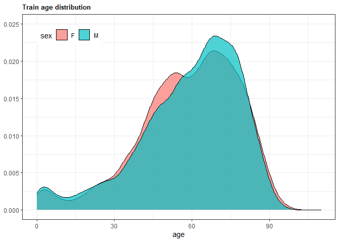
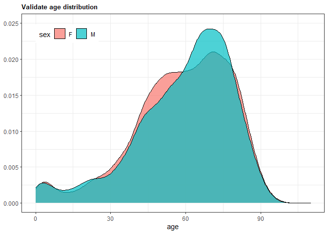
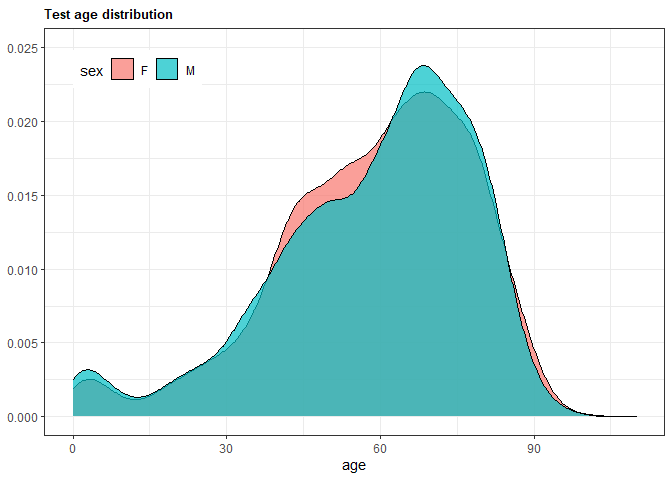
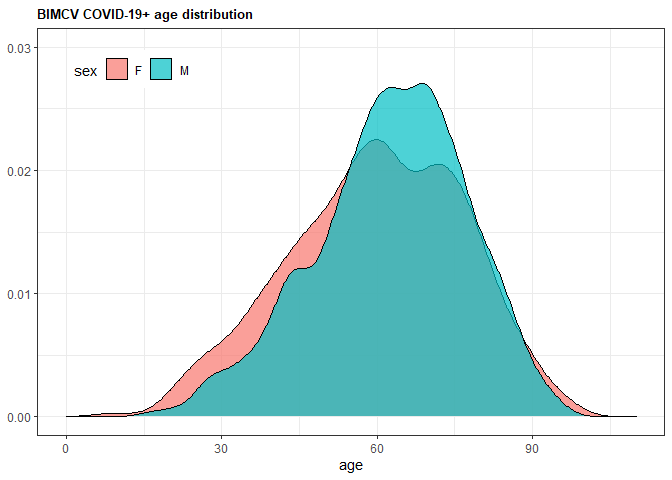
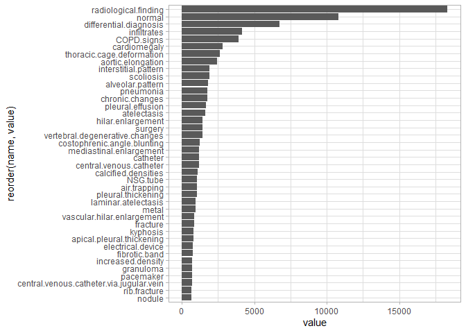
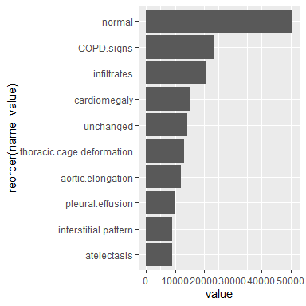
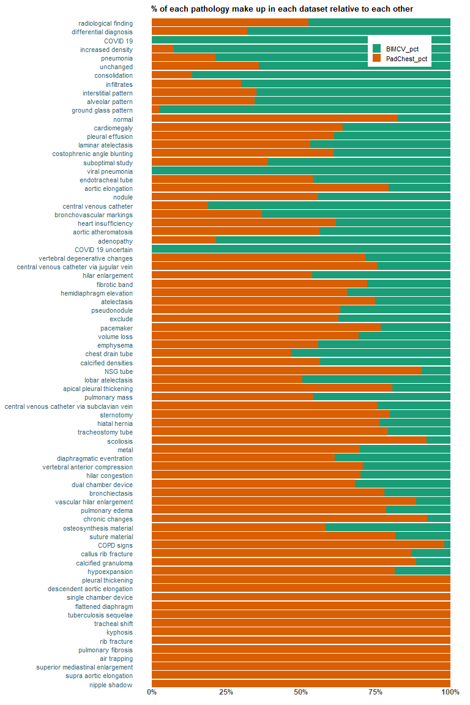

thesis
================

``` r
library(ggplot2)
library(dplyr)
```

    ## 
    ## Attaching package: 'dplyr'

    ## The following objects are masked from 'package:stats':
    ## 
    ##     filter, lag

    ## The following objects are masked from 'package:base':
    ## 
    ##     intersect, setdiff, setequal, union

``` r
library(tidyr)
#library(tidyverse)
```

``` r
train <- read.csv("train.csv")
validate <- read.csv("validate.csv")
test <- read.csv('test_2.csv')
datasets <- read.csv('datasets.csv')

#padchest <- read.csv("padchest_all.csv")
padchest <- read.csv("padchest2_all.csv")

covid <- read.csv("covid_all.csv")
```

``` r
ggplot(train,aes(x=age)) + geom_density(aes(fill = sex),alpha=0.7)+
  theme_bw() +ggtitle("Train age distribution") + ylim(0, .025) + xlim(0, 110) + theme(legend.position = c(0.15, 0.9),
          legend.direction = "horizontal" ,plot.title = element_text(size = 10, face = "bold"),axis.title.y = element_blank())
```

<!-- -->

``` r
ggplot(validate,aes(x=age)) + geom_density(aes(fill = sex),alpha=0.7)+
  theme_bw() +ggtitle("Validate age distribution") + ylim(0, .025) + xlim(0, 110) + theme(legend.position = c(0.15, 0.9),
          legend.direction = "horizontal",plot.title = element_text(size = 10, face = "bold"),axis.title.y = element_blank())
```

<!-- -->

``` r
ggplot(test,aes(x=age)) + geom_density(aes(fill = sex),alpha=0.7)+
  theme_bw() +ggtitle("Test age distribution") + ylim(0, .025) + xlim(0, 110) + theme(legend.position = c(0.15, 0.9),
          legend.direction = "horizontal",plot.title = element_text(size = 10, face = "bold"),axis.title.y = element_blank())
```

<!-- -->

``` r
ff <- padchest[padchest$sex %in% c('M','F'),]


ggplot(ff,aes(x=age)) + geom_density(aes(fill = sex),alpha=0.7)+
  theme_bw() +ggtitle("PadChest age distribution") + ylim(0, .03) + xlim(0, 110) + theme(legend.position = c(0.15, 0.9),
          legend.direction = "horizontal",plot.title = element_text(size = 10, face = "bold"),axis.title.y = element_blank())
```

<!-- -->

``` r
ggplot(covid,aes(x=age)) + geom_density(aes(fill = sex),alpha=0.7)+
  theme_bw() +ggtitle("BIMCV COVID-19+ age distribution") + ylim(0, .03) + xlim(0, 110) + theme(legend.position = c(0.15, 0.9),
          legend.direction = "horizontal",plot.title = element_text(size = 10, face = "bold"),axis.title.y = element_blank())
```

<!-- -->

``` r
df <- subset(train, select = -c(X,filename,PatientID,ReportID,age,sex,Labels,Labels2))
df2 <- df %>% 
    summarise_all(sum)

df_v <- subset(validate, select = -c(X,filename,PatientID,ReportID,age,sex,Labels,Labels2))
df2_v <- df_v %>% 
    summarise_all(sum)
```

``` r
df_covid <- subset(covid, select = -c(X,img_list,view,colour,sub,ses,check_colour,check_view,PatientID,ReportID,Labels,Labels2,age,sex))
df2_covid <- df_covid %>% 
    summarise_all(sum)


df_pc <- subset(padchest, select = -c(X,filename,PatientID,ReportID,age,sex,Labels,Labels2))
df2_pc <- df_pc %>% 
    summarise_all(sum)


Datalong_c <- pivot_longer(df2_covid, cols = COPD.signs:volume.loss, names_to = "name")
df2_covid_l <- Datalong_c[order(-Datalong_c$value),]

Datalong_p <- pivot_longer(df2_pc, cols = COPD.signs:respiratory.distress, names_to = "name")
df2_pc_l <- Datalong_p[order(-Datalong_p$value),]
```

``` r
Datalong <- pivot_longer(df2, cols = COPD.signs:differential.diagnosis, names_to = "name")
dl <- Datalong[order(-Datalong$value),]

Datalong_v <- pivot_longer(df2_v, cols = COPD.signs:differential.diagnosis, names_to = "name")
dl_v <- Datalong_v[order(-Datalong_v$value),]

ggplot(data = dl[1:40,]) + geom_col(aes(x = reorder(name,value), y = value)) + coord_flip() +theme_light()
```

<!-- -->

``` r
ggplot(data = dl_v[1:40,]) + geom_col(aes(x = reorder(name,value), y = value)) + coord_flip() +theme_light()
```

<!-- -->

``` r
#ggplot(df2,aes(x=colnames,y=row[1]) + geom_bar()
```

``` r
#Datalong_covid <- pivot_longer(df2_covid, cols = COPDsigns:volumeloss, names_to = "name")
#dl_covid <- Datalong_covid[order(-Datalong_covid$value),]

Datalong_padchest <- pivot_longer(df2_pc, cols = COPD.signs:volume.loss, names_to = "name")
dl_padchest <- Datalong_padchest[order(-Datalong_padchest$value),]

#ggplot(data = dl_covid[1:10,]) + geom_col(aes(x = reorder(name,value), y = value)) + coord_flip()
ggplot(data = dl_padchest[1:10,]) + geom_col(aes(x = reorder(name,value), y = value)) + coord_flip()
```

<!-- -->

``` r
#ggplot() + geom_col(data=dl_covid[1:10,],aes(x = reorder(name,value), y = value)) + 
  
#geom_col(data = dl_padchest[1:10,],aes(x = reorder(name,value), y = value)) + coord_flip()

#ggplot(df2,aes(x=colnames,y=row[1]) + geom_bar()
```

``` r
df_prop <- merge(dl,dl_v, by ='name', sort = TRUE)
colnames(df_prop) <- c("Name", "Train","Validate")
df_prop_long <- gather(df_prop, dataset ,measurement, Train:Validate, factor_key=TRUE)


#df_prop2 <- merge(df2_covid_l,df2_pc_l, by ='name', sort = TRUE)
#colnames(df_prop2) <- c("Name", "PadChest","BIMCV")
#df_prop_long2 <- gather(df_prop2, dataset ,measurement, PadChest:BIMCV, factor_key=TRUE)
```

``` r
library(scales)

ggplot(df_prop_long, aes(x = measurement, y=reorder(Name,measurement), fill=dataset)) +
   geom_col(position="fill")  +
  
  scale_x_continuous(name = "",  labels = scales::percent) + 
  
  #scale_fill_brewer(palette = "Set1", name = "Uploads") +
  
   scale_fill_manual(values = c( "#1b9e77", "#d95f02"),
                     name = NULL) +
  
 ggtitle("   Percentage train/validation dataset") +
  
  theme_classic() +
  
  theme(
        axis.line.x = element_blank(),
        axis.ticks.x = element_blank(),
        axis.ticks.y = element_blank(),
        axis.line.y= element_blank(),
        axis.title.x=element_blank(), 
        axis.text.x = element_text(  vjust = 5, size=9, face="bold"),
        axis.text.y = element_text( size=7),
        axis.title.y = element_text(size=9, face="bold"),
        legend.text = element_text(size=8),
        legend.title = element_blank(),
        #legend.position = c(0.8,0.9),
        
        legend.key.size = unit(0.8,"line"),
        plot.title=element_text( hjust=0.00, face='bold', size=10)
        
        ) 
```

    ## Warning: Removed 2 rows containing missing values (geom_col).

<!-- -->

``` r
datasets_long <- gather(datasets, dataset ,measurement, BIMCV:PadChest, factor_key=TRUE)
datasets_long_pct <- gather(datasets, dataset ,measurement, BIMCV_pct:PadChest_pct, factor_key=TRUE)
ex11_mydata<-filter(datasets_long_pct, dataset=='BIMCV_pct')
datasets_long_pct$Pathology <- factor(datasets_long_pct$Pathology, levels = rev(unique(ex11_mydata$Pathology[order(ex11_mydata$measurement)])))


datasets_25 <- filter(datasets,BIMCV > 34 | PadChest >500)

datasets_long <- gather(datasets_25, dataset ,measurement, BIMCV:PadChest, factor_key=TRUE)
datasets_long_pct_25 <- gather(datasets_25, dataset ,measurement, BIMCV_pct:PadChest_pct, factor_key=TRUE)

datasets_long_pct_25_2 <- filter(datasets_long_pct_25, measurement > 0.0004596290)
 
#datasets_long_pct_25_3 <- unique(datasets_long_pct_25_2)
#ex11_mydata_25<-filter(datasets_long_pct_25, dataset=='BIMCV_pct')
#datasets_long_pct_25$Pathology <- factor(datasets_long_pct_25$Pathology, levels = rev(unique(ex11_mydata_25$Pathology[order(ex11_mydata_25$measurement)])))
#dd <- filter(datasets_long_pct_25,dataset=='BIMCV_pct')
```

``` r
library(scales)

ggplot(datasets_long_pct_25_2, aes(x = measurement, y=reorder(Pathology,BIMCV), fill=dataset)) +
   geom_col(position="fill")  +
  
  scale_x_continuous(name = "",  labels = scales::percent) + 
  
  #scale_fill_brewer(palette = "Set1", name = "Uploads") +
  
   scale_fill_manual(values = c( "#1b9e77", "#d95f02"),
                     name = NULL) +
  
 ggtitle("      % of each pathology make up in each dataset relative to each other ") +
  
  theme_classic() +
  
  theme(
        axis.line.x = element_blank(),
        axis.ticks.x = element_blank(),
        axis.ticks.y = element_blank(),
        axis.line.y= element_blank(),
        axis.title.x=element_blank(), 
        axis.text.x = element_text(  vjust = 5, size=9, face="bold"),
        axis.text.y = element_text( size=8,colour  = ifelse(datasets_long_pct_25_2$Pathology %in% "calcified granuloma " , "red", "#35636D")
),
        axis.title.y = element_blank(),
        legend.text = element_text(size=8),
        legend.title = element_blank(),
        legend.position = c(0.8,0.95),
        legend.key.size = unit(0.8,"line"),
        plot.title=element_text( hjust=0.00, face='bold', size=10)
        ) 
```

    ## Warning: Vectorized input to `element_text()` is not officially supported.
    ## Results may be unexpected or may change in future versions of ggplot2.

<!-- -->

``` r
#'consolidation', 'ground glass pattern', 'alveolar pattern', 'Covid 19',
#colour  = ifelse(OECD_text$LOCATION %in% "COVDI 19" , "red", "#35636D")
```
